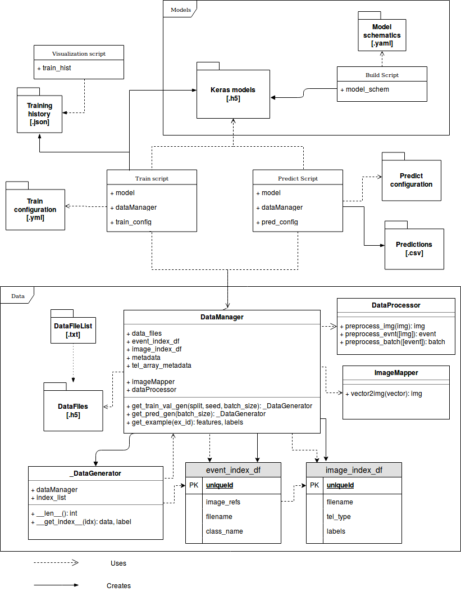

# CTALearn Keras
A proof-of-concept project reimagining the architectural design of the [CTLearn project](https://github.com/ctlearn-project/ctlearn).

Major changes with respect to the original repository are:

* Use of the Keras API for training and prediction
* Use of Pandas for managing the data spread across multiple files
* Stronger division of the model building, training and prediction responsibilities
* the ImageMapper and DataProcessor classes have been hidden from the user

## How to build and train a model

1. Create a folder to be your training folder, cd to it
2. Create a `model_schematics.yml` file
3. Run `python model_building/build_model.py model_schematics.yml`. This will create a file `model.h5` ready to train
4. Create a `train_config.yml` file
5. Run `python train.py model.h5 train_config.yml`. This will create `session.log`, `model_XXXX.h5` and `history.h5`.
